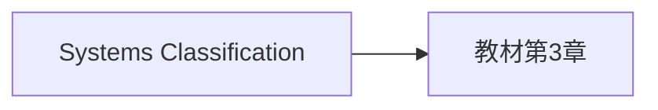

## 小节概述
LTI系统(线性+时不变)是雷达信号处理的基本模型。线性：满足叠加性和齐次性；时不变：系统参数不随时间变化。稳定系统保证有界输入对应有界输出(BIBO)。因果系统的输出只依赖当前和过去的输入。
## 关键知识点
详见教材对应章节。
## 知识结构

```mermaid
graph LR
    A[Systems Classification]-->B["教材第3章"]
```
