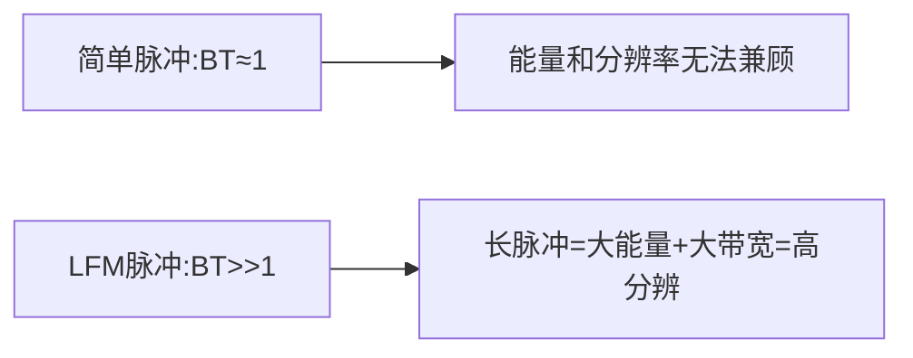

## 小节概述
时宽带宽积BT是脉冲压缩信号的核心参数。简单脉冲(BT≈1)无法同时获得高能量和高分辨率。LFM信号的BT»1——这是通过频率调制实现的。压缩比CR=BT决定了脉冲压缩能获得的分辨率改善倍数。

## 知识结构

```mermaid
graph LR
    A["简单脉冲:BT≈1"]-->B["能量和分辨率无法兼顾"]
    C["LFM脉冲:BT>>1"]-->D["长脉冲=大能量+大带宽=高分辨"]
```
